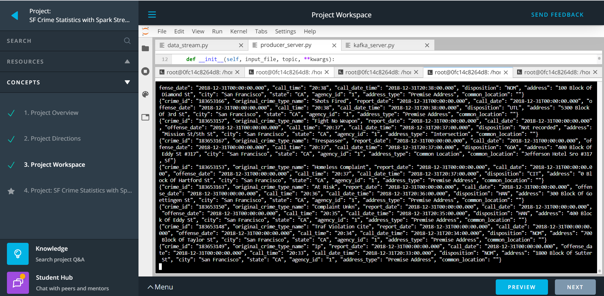
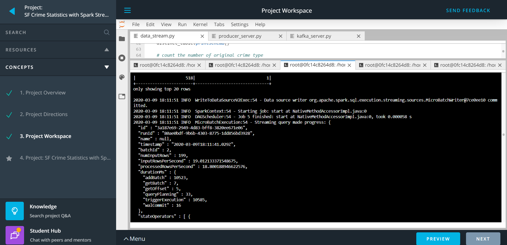
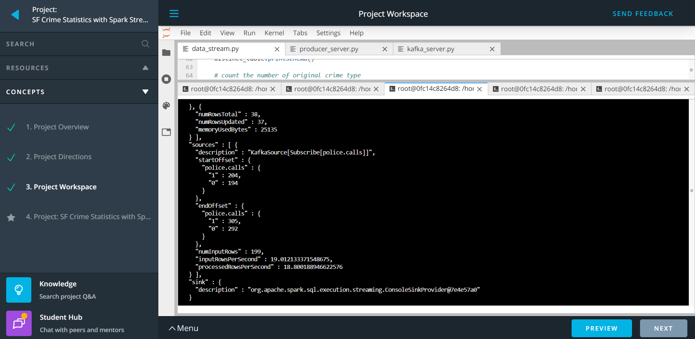
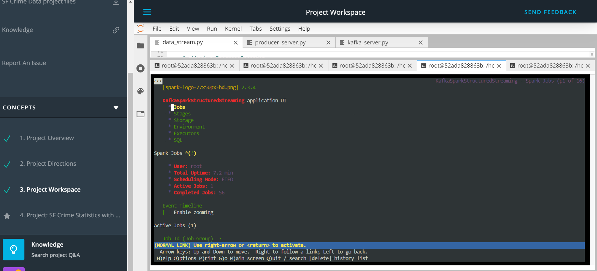
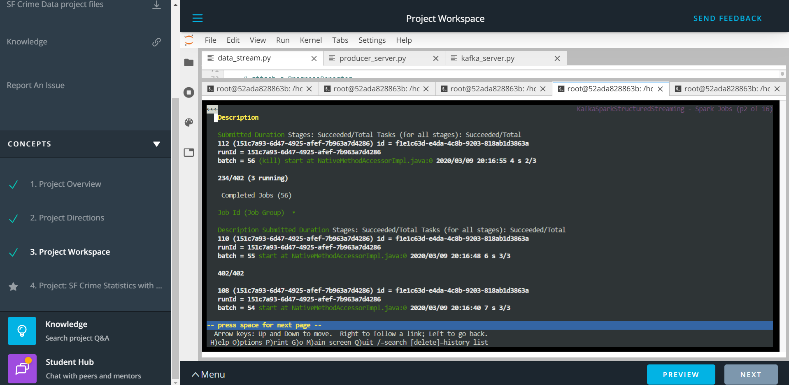
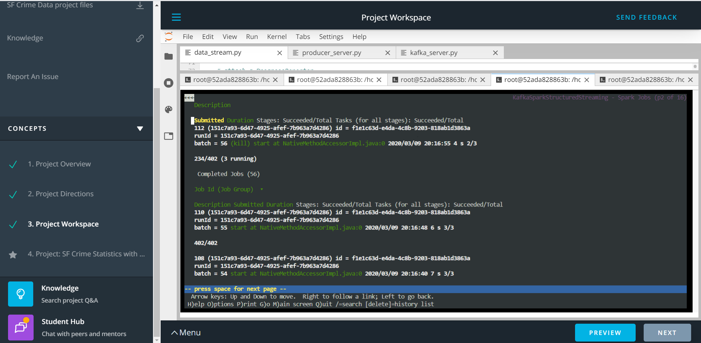

# SF Crime Statistics with Spark streaming project

## Project overview 

To provide a statistical analysis of the data using Apache Spark Structured Streaming based on the couple of Kaggle datasets. This project demostrates one's Kafka and spark integration skills. 

## Implementation steps

### Step-1: Create a Kafka producer

- Edit the `server.properties` config file to use 9092 port for the Kafka cluster. No changes are needed  for `server.properties` file
- Using `zookeeper-server-start` utitlity start the zookeeper server at CLI
- Using `kafka-server-start` utility start the kafka cluster
- Execute `./start.sh` command at CLI
- Complete the logic in `producer_server.py` and `kafka_server.py`to create a Kafka producer
    - `police.calls` is the topic name used during the configuration
    - `9092` is the port used for Kafka cluster during the configuration
- Execute `python kafka_server.py` at the CLI. 
- Run `kafka-console-consumer --topic police.calls --bootstrap-server localhost:9092 --from-beginning` command from CLI and capture the output generated at the console

    
    
### Step-2: Ingest the Kafka generated data into Spark using structured streaming

- Create a `readstream` and ingest the date from Kafka topic `police.calls`
- Find the number of occurences of `original_crime_type_name`
- Create `writestream` by writing the aggregated output in the console
- Capture the output generated at the console

    
    
    
    
    
        
- Run `sudo apt install lynx -y` at the CLI to install lynx text based browser
- Launch the browser by running `lynx localhost:4040` command at the CLI
- Navigate to 'Jobs' and 'Stages' submenu and capture the below screenshots 

    
    
    
    
    
    

### Answers to questions

1. How did changing values on the SparkSession property parameters affect the throughput and latency of the data?
    
    - more the `processedRowsPerSecond` higher the rate of data processed 

2. What were the 2-3 most efficient SparkSession property key/value pairs? Through testing multiple variations on values, how can you tell these were the most optimal?

    - `numInputRows` : The aggregate (across all sources) number of records processed in a trigger.
    - `inputRowsPerSecond` : The aggregate (across all sources) rate of data arriving.
    - `processedRowsPerSecond` : The aggregate (across all sources) rate at which Spark is processing data.